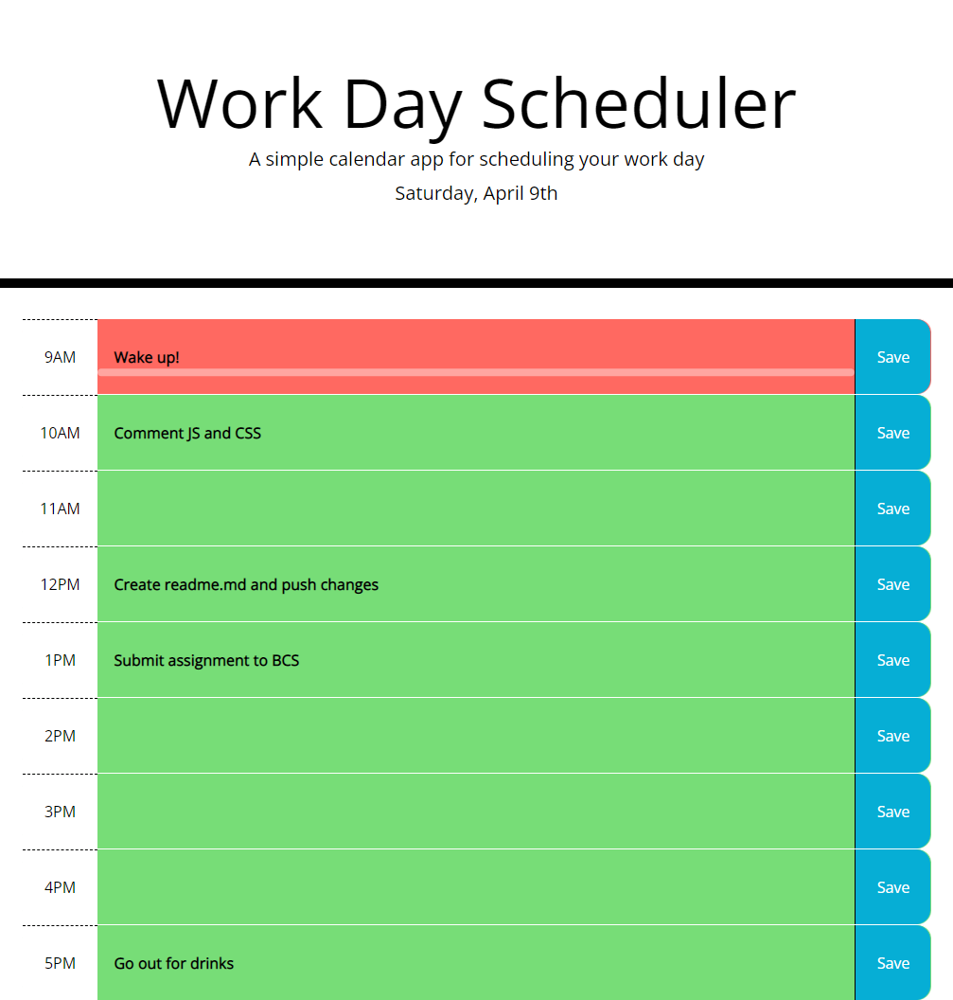

# Day-Scheduler

## Goal
Design and develop a simple daily planner with persistence and time tracking

---
## Website URL
https://daman29.github.io/Day-Scheduler/

Link above takes you to the webpage.

---

## Description

- Utilised Moment.JS to manage time functions
- Jquery library used to simplify HTML document traversal, manipulation and event handling
- Current day is displayed at the top of the page
- Stores all notes and tasks on save button click
- Recalls the saved notes and tasks on refresh but only if it is the same day
- Time blocks color coded to allow for easy tracking: Red = present, gray = past, green = future
- Each time block is an input field

---
## Damneet's Day planner
Below is the screen capture of the webpage.

---

## Bonus
- Progress bar added to the page to easily and intuitively show current time progress through the day.